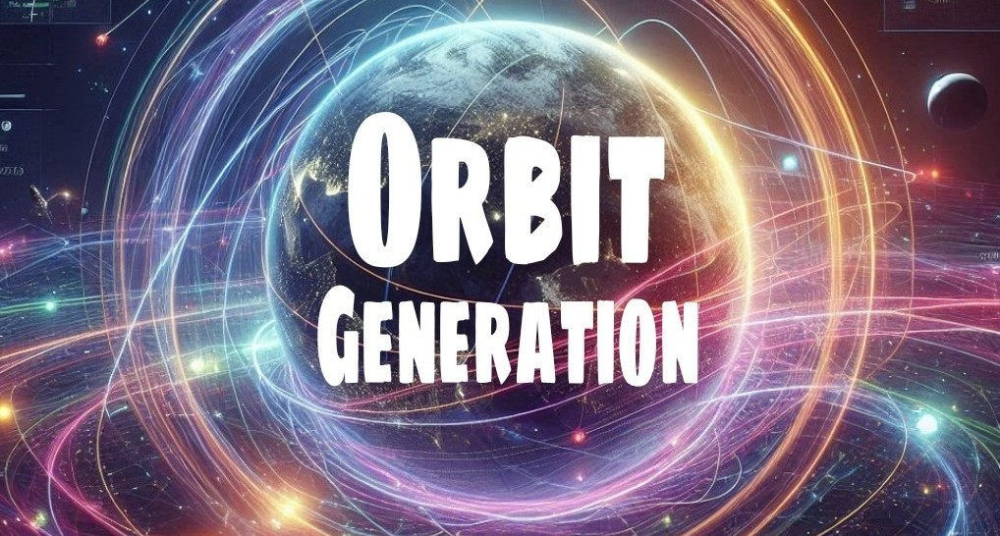
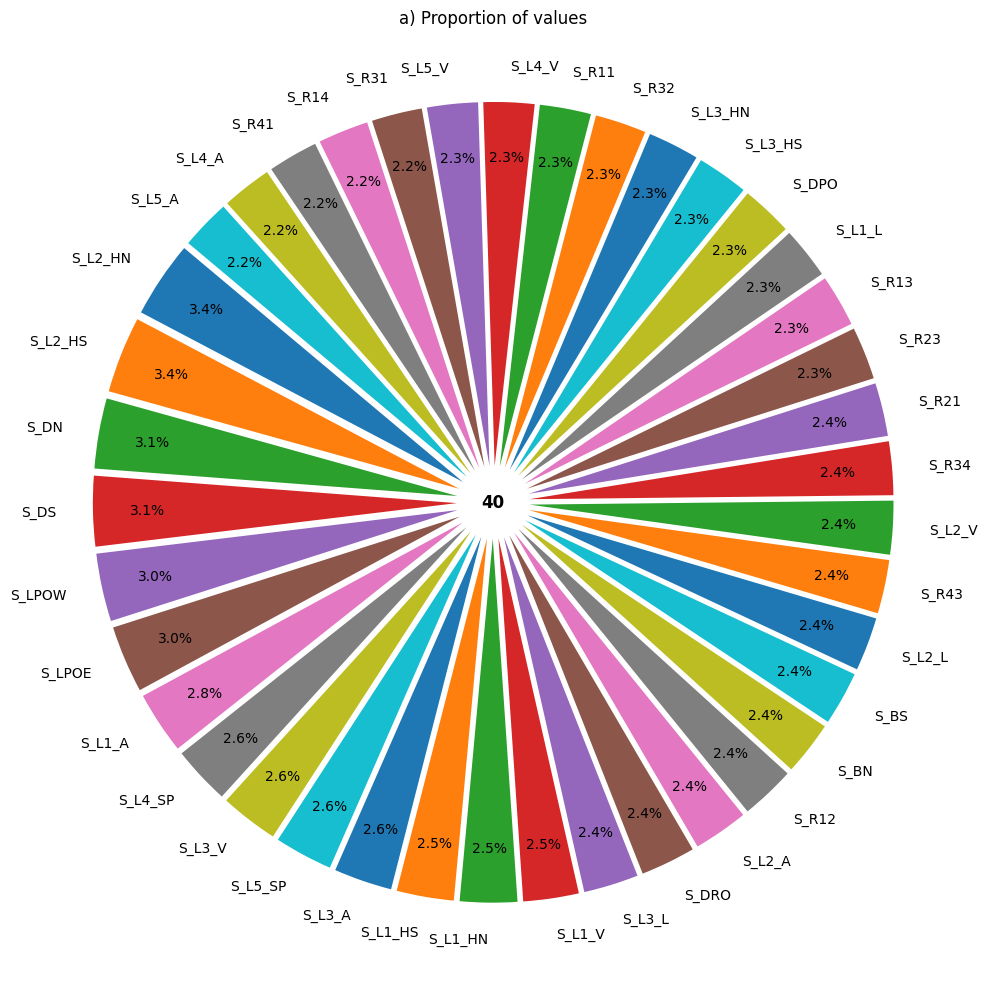
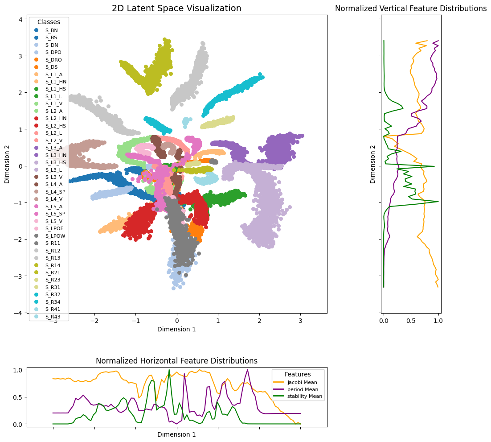
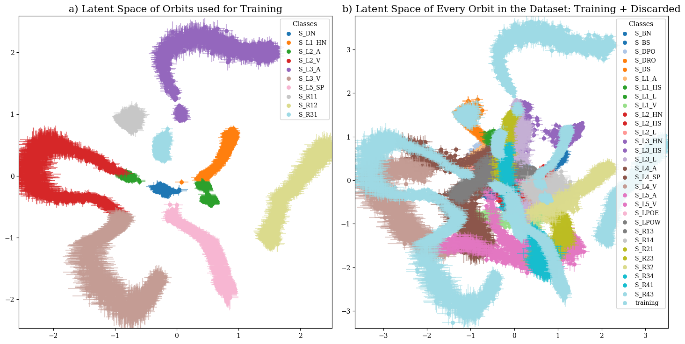
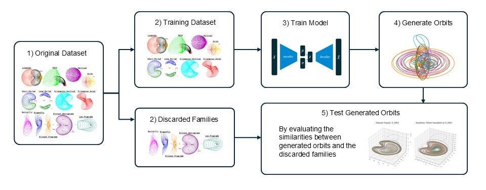

# orbit-generation


<!-- WARNING: THIS FILE WAS AUTOGENERATED! DO NOT EDIT! -->



This library has been built using [nbdev](https://nbdev.fast.ai/), which
means that the source code of the library is stored in Jupyter notebooks
inside the [`nbs`](./nbs/) folder. These notebooks are then
automatically converted into Python files inside the
[`orbit_generation`](./orbit_generation/) folder.

Apart from the library, we have included research experiments using the
library in the [`nbs_experiments`](./nbs_experiments/) folder.

First, we will review the library structure, functions, and finally, we
will explain the [experiments
conducted](#Generative-Discovery-Experiment).

## Publications

- [SPAICE 2024: Generative Design of Periodic Orbits in the Restricted
  Three-Body Problem](https://zenodo.org/records/13885649)
- AAS 2025: Generative Astrodynamics: Trajectory Analysis and Design in
  the Restricted Three-Body Problem

## Structure

``` text
.
|-- .devcontainer: Configuration for the development container.  
|  
|-- .github: workflows for continuous integration in Git.  
|  
|-- data: The folder where datasets are stored, in GitHub only example data is included. 
|   |-- example_data
|   |-- orbits_fix_1500 (needs to be downloaded)
|
|-- docs: Documentation files for the project. 
|
|-- experiments: Results about the experiments performed. 
|
|-- index_files: Auto-generated images to be used in the README.md. 
| 
|-- julia: Scripts written in Julia for specific computations. 
|   `-- convergence_algorithm.jl
|
|-- models: Some Machine Learning models used in the experiments.
|   |-- family_classificators
|   |-- orbit_generators
|
|-- nbs: Jupyter notebooks containing the source code for the library.  
|   |-- 00_constants.ipynb
|   |-- 01_data.ipynb
|   |-- 02_orbit_processing.ipynb
|   |-- 03_visualization.ipynb
|   |-- 04_orbit_statistics.ipynb
|   |-- 05_dataset.ipynb
|   |-- 06_architectures.ipynb
|   |-- 07_propagation.ipynb
|   |-- 08_experiment.ipynb
|   |-- 09_evaluation.ipynb
|   |-- 10_vae.ipynb
|   |-- 11_model_factory.ipynb
|   |-- 12_convergence.ipynb
|   |-- 13_latent_space.ipynb
|   |-- 14_path_utils.ipynb
|   |-- index.ipynb
|
|-- nbs_experiments: Notebooks with research experiments using the library.  
|   |-- 01_generative_discovery_em
|
|-- orbit_generation: Auto-generated Python package containing the processed library code. 
|  
|-- .gitignore: Defines files Git should ignore.
|  
|-- LICENSE: Project license file.  
|  
|-- MANIFEST.in: Specifies which files to include in the package distribution.   
|  
|-- README.md: Documentation for the project, auto-generated from index.ipynb.  
|  
|-- settings.ini: Configuration file for `nbdev`.  
|  
|-- setup.py: Script for installing the package.
```

## Library Modules

``` sh
pip install orbit_generation
```

### 0. Constants

This module contains physical constants and orbit labels.

``` python
from orbit_generation.constants import MU_BY_SYSTEM, EM_POINTS, EM_MU
```

``` python
MU_BY_SYSTEM
```

    {'SaE': 1.901109735892602e-07,
     'MP': 1.611081404409632e-08,
     'SaT': 0.0002366393158331484,
     'EM': 0.01215058560962404,
     'JE': 2.52801752854e-05,
     'SE': 3.0542e-06,
     'SM': 3.227154996101724e-07}

``` python
EM_POINTS
```

    {'Moon': (0.987849414390376, 0, 0),
     'Earth': (-0.01215058560962404, 0, 0),
     'Lagrange 1': (0.8369, 0, 0),
     'Lagrange 2': (1.1557, 0, 0),
     'Lagrange 3': (-1.0051, 0, 0),
     'Lagrange 4': (0.4879, 0.866, 0),
     'Lagrange 5': (0.4879, -0.866, 0)}

### 1. Data

This module provides utilities for handling orbit data.

``` python
from orbit_generation.data import get_example_orbit_data
```

``` python
orbit_data = get_example_orbit_data()
orbit_data.shape
```

    (400, 7, 100)

- Number of orbits: 400
- Time instants: 100

Every orbit dataset is organized within a three-dimensional NumPy array
with the following structure:

<center>

<font size="5">data.shape = (num_orbits, 7, num_time_points)</font>
</center>

- **`num_orbits`**: Total number of distinct orbits in the dataset.  
- **`7`**: Represents the seven scalar values for each orbit at each
  time point, typically including:
  - **`time`**: The time corresponding to each recorded state.  
  - **`posX`**, **`posY`**, **`posZ`**: Position components in the X, Y,
    and Z dimensions, respectively.  
  - **`velX`**, **`velY`**, **`velZ`**: Velocity components in the X, Y,
    and Z dimensions, respectively.  
- **`num_time_points`**: Number of time instants at which the data for
  each orbit is recorded.

### 2. Processing

This module performs various processing tasks on the orbit data
described above, including downsampling, interpolation, and reshaping.

``` python
from orbit_generation.processing import resample_3d_array
```

``` python
resampled_orbit_data = resample_3d_array(data=orbit_data, axis=2, target_size= 50)
resampled_orbit_data.shape
```

    (400, 7, 50)

- Initial time instants: 100
- Time instants after Resampling: 50

### 3. Visualization

This module handles the visualization of orbit trajectories and their
features.

#### Orbits

``` python
from orbit_generation.visualize import visualize_static_orbits, export_dynamic_orbits_html
```

``` python
visualize_static_orbits(orbit_data, show_legend=False)
```


``` python
visualize_static_orbits(data= orbit_data, orbit_indices=[315,120,70,180,190], point_dict=EM_POINTS)
```


``` python
visualize_static_orbits(data= orbit_data, time_instants=[0,50], orbit_indices=[40], plot_reference_box=False)
```


``` python
export_dynamic_orbits_html(data=orbit_data, filename='../data/example_training_data/example_orbits_visualization.html')
```

    Visualization saved to ../data/example_training_data/example_orbits_visualization.html

See the dynamic orbit visualziation
[`here`](../data/example_training_data/example_orbits_visualization.html)

#### Features

Example plots performed with this module:




### 4. Statistics

This module analyzes the orbital data using descriptive statistics.

``` python
from orbit_generation.stats import plot_histograms_position, plot_histograms_comparison
```

``` python
plot_histograms_position(orbit_data)
```


``` python
plot_histograms_comparison(orbit_data[0:200,1:], orbit_data[200:400,1:], normalize=True)
```


### 5. Dataset

Scripts to build the different datasets used for modeling.

The following function was used to obtain the datasets for the research:

``` python
from orbit_generation.dataset import get_first_period_dataset
```

The function takes: - file_path: Path to HDF5 file containing orbit
data - segment_length: Optional length to segment orbits into (default
100)

Returns: - Segmented orbits as memory-mapped array - DataFrame with
orbit features - Array of segment IDs - Dictionary of system features
(mass ratios, etc)

### 6. Architectures

Module where different model architectures are defined—such as losses,
decoders, and callbacks—designed to be modular and reusable.

``` python
from orbit_generation.architectures import Conv5Encoder
```

``` python
model = Conv5Encoder(
    seq_len=100,      # Sequence length for input data
    feat_dim=7,       # Feature dimension (number of features per timestep)
    latent_dim=32,    # Dimension of latent space
    dropout_rate=0.1  # Dropout rate for regularization
)
print("Conv5Encoder Summary:")
print(model._modules) # Access modules dictionary since it extends nn.Module
```

    Conv5Encoder Summary:
    {'convo_layers': Sequential(
      (0): Conv1d(7, 64, kernel_size=(3,), stride=(1,), padding=same)
      (1): ReLU()
      (2): Dropout(p=0.1, inplace=False)
      (3): Conv1d(64, 64, kernel_size=(5,), stride=(1,), padding=same)
      (4): ReLU()
      (5): Dropout(p=0.1, inplace=False)
      (6): Conv1d(64, 64, kernel_size=(7,), stride=(1,), padding=same)
      (7): ReLU()
      (8): Dropout(p=0.1, inplace=False)
      (9): Conv1d(64, 64, kernel_size=(9,), stride=(1,), padding=same)
      (10): ReLU()
      (11): Dropout(p=0.1, inplace=False)
      (12): Conv1d(64, 64, kernel_size=(13,), stride=(1,), padding=same)
      (13): ReLU()
      (14): Dropout(p=0.1, inplace=False)
      (15): Flatten(start_dim=1, end_dim=-1)
    ), 'dense_layers': Sequential(
      (0): Linear(in_features=6400, out_features=512, bias=True)
      (1): ReLU()
      (2): Linear(in_features=512, out_features=64, bias=True)
      (3): ReLU()
      (4): Linear(in_features=64, out_features=64, bias=True)
    )}

### 7. Propagation

This module enables orbit propagation and measures physical consistency.

``` python
from orbit_generation.propagation import calculate_errors
```

``` python
errors = calculate_errors(orbit_data, EM_MU, orbit_indices = [0])
```

    Cumulative position error for selected orbits: 5.095048112547387e-05
    Average position error per time step: 5.14651324499736e-07


    Cumulative velocity error for selected orbits: 0.0001793751728135454
    Average velocity error per time step: 1.8118704324600546e-06


    Cumulative energy error for selected orbits: 0.0003757476806640625
    Average energy error per time step: 3.7954312119836686e-06


### 8. Experiment Tools

Scripts to manage data and results and parallelize experiments used in
the [`nbs_experiments`](./nbs_experiments/) folder.

### 9. Evaluation

Module to evaluate distances, clustering metrics and vanilla machine
learning models.

``` python
from orbit_generation.evaluation import calculate_pairwise_orbit_distances
```

``` python
calculate_pairwise_orbit_distances(orbit_data[0:1], orbit_data[1:2], distance_metric='manhattan')
```

    array([85.13618469])

### 10. Variational Auto Encoder (VAE)

This module builds VAE models using the architecures from
[`6. Architectures`](./nbs/06_architectures.ipynb)

``` python
from orbit_generation.vae import BetaVAE
```

``` python
print("BetaVAE properties:")
for key, value in BetaVAE.__dict__.items():
    if not key.startswith('_'):
        print(f"- {key}")
```

    BetaVAE properties:
    - setup
    - encode
    - decode
    - forward
    - reconstruction_loss_by_axis
    - default_loss_fn
    - training_step
    - validation_step
    - configure_optimizers
    - sample
    - on_train_epoch_start
    - on_validation_epoch_start

### 11. Model Factory

Module to create model instances based on configuration files.

``` python
from orbit_generation.model_factory import get_model
import torch
```

``` python
params = {
    'model_name': 'inception_time_vae',
    'seq_len': 100,
    'feature_dim': 6,
    'latent_dim': 32,
    'model_kwargs': {
        'beta': 1.0,
        'lr': 0.001,
        'optimizer_cls': torch.optim.Adam
    }
}

model = get_model(params)
```

### 12. Convergence

Script to perform a Multiple Shooting algorithm on the synthetic orbits
to process differential corrections until they become physically valid.

Example of synthetic orbits (left) and its refined versions (right):


### 13. Latent Space

Module to explore a model’s latent space, visualize it, apply
dimensionality reduction techniques, and perform sampling.

Examples of plots produced with this module:






## Generative Discovery Experiment



### 0. Figures

Exported images of the experiments below.

### 1. Exploratory Data Analysis of Earth-Moon Periodic Orbits

This
[notebook](./nbs_experiments/01_generative_discovery_em/01_eda_em_system.ipynb)
explores the dataset by visualizing the orbits, the proportions within
families, the initial conditions, and the distribution of features.

### 2. Orbit Family Analysis

This
[notebook](./nbs_experiments/01_generative_discovery_em/02_orbit_family_analysis.ipynb)
searches for the best properties of the orbits that define their family
through clustering and machine learning techniques.

### 3. Generative Discovery

These notebooks
([03_01_generative_discovery](./nbs_experiments/01_generative_discovery_em/03_01_generative_discovery.ipynb),
[03_02_experiment_parameterization](./nbs_experiments/01_generative_discovery_em/03_02_experiment_parameterization.ipynb),
[03_03_discovery_results](./nbs_experiments/01_generative_discovery_em/03_03_discovery_results.ipynb),
[03_04_ml_classification_discovery](./nbs_experiments/01_generative_discovery_em/03_04_ml_classification_discovery.ipynb),
[03_05_distance_discovery](./nbs_experiments/01_generative_discovery_em/03_05_distance_discovery.ipynb))
perform the “Generative Discovery” experiment by training a VAE on a
subset of the dataset, generating orbits and refining them, obtaining
metrics and visual explorations throughout the entire process. The first
notebooks are used for running the experiments and the later ones for
analyzing the results.

### 4. Convergence Analysis

This
[notebook](./nbs_experiments/01_generative_discovery_em/04_convergence_analysis.ipynb)
performs a convergence analysis of the synthetic orbits generated by the
VAE, studying the effect of certain parameters for the multiple shooting
algorithm.

### 5. Model Analysis

This
[notebook](./nbs_experiments/01_generative_discovery_em/05_model_analysis.ipynb)
performs an analysis of a specific model to deepen the understanding of
the model’s behavior.
