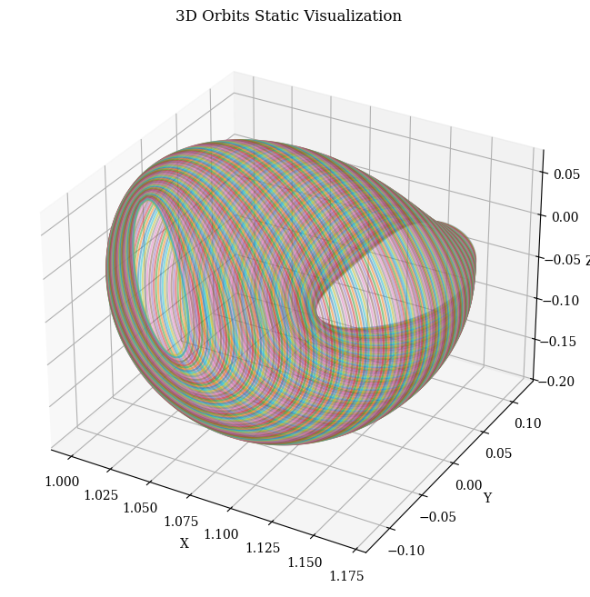

# orbit-generation


<!-- WARNING: THIS FILE WAS AUTOGENERATED! DO NOT EDIT! -->

This library has been built using [nbdev](https://nbdev.fast.ai/), which
means that the source code of the library is stored in Jupyter notebooks
inside the [`nbs`](../nbs/) folder. These notebooks are then
automatically converted into Python files inside the
[`orbit_generation`](../orbit_generation/) folder.

Apart from the library, we have included research experiments using the
library in the [`nbs_experiments`](../nbs_experiments/) folder.

First, we will review the library structure, functions, and finally, we
will explain the experiments conducted.

## Structure

``` text
.
|-- .devcontainer: Configuration for the development container.  
|  
|-- .github: workflows for continuous integration in Git.  
|  
|-- data: The folder where datasets are stored, in GitHub only example data is included. 
|   |-- example_data
|   |-- orbits_fix_1500 (needs to be downloaded)
|
|-- docs: Documentation files for the project. 
|
|-- experiments: Results about the experiments performed. 
|
|-- index_files: Auto-generated images to be used in the README.md. 
| 
|-- julia: Scripts written in Julia for specific computations. 
|   `-- convergence_algorithm.jl
|
|-- models: Some Machine Learning models used in the experiments.
|   |-- family_classificators
|   |-- orbit_generators
|
|-- nbs: Jupyter notebooks containing the source code for the library.  
|   |-- 00_constants.ipynb
|   |-- 01_data.ipynb
|   |-- 02_orbit_processing.ipynb
|   |-- 03_visualization.ipynb
|   |-- 04_orbit_statistics.ipynb
|   |-- 05_dataset.ipynb
|   |-- 06_architectures.ipynb
|   |-- 07_propagation.ipynb
|   |-- 08_experiment.ipynb
|   |-- 09_evaluation.ipynb
|   |-- 10_vae.ipynb
|   |-- 11_model_factory.ipynb
|   |-- 12_convergence.ipynb
|   |-- 13_latent_space.ipynb
|   |-- 14_paper_specific.ipynb
|   |-- index.ipynb
|
|-- nbs_experiments: Notebooks with research experiments using the library.  
|   |-- 01_generative_discovery_em
|   |-- 02_conditional_generation_systems
|
|-- orbit_generation: Auto-generated Python package containing the processed library code. 
|  
|-- .gitignore: Defines files Git should ignore.
|  
|-- LICENSE: Project license file.  
|  
|-- MANIFEST.in: Specifies which files to include in the package distribution.   
|  
|-- README.md: Documentation for the project, auto-generated from index.ipynb.  
|  
|-- settings.ini: Configuration file for `nbdev`.  
|  
|-- setup.py: Script for installing the package.  

## Library Modules

```sh
pip install orbit_generation
```

### 0. Constants

This module contains physical constants and orbit labels.

``` python
from orbit_generation.constants import MU_BY_SYSTEM, EM_POINTS, EXTENDED_ORBIT_CLASSIFICATION
```

``` python
MU_BY_SYSTEM
```

    {'SaE': 1.901109735892602e-07,
     'MP': 1.611081404409632e-08,
     'SaT': 0.0002366393158331484,
     'EM': 0.01215058560962404,
     'JE': 2.52801752854e-05,
     'SE': 3.0542e-06,
     'SM': 3.227154996101724e-07}

``` python
EM_POINTS
```

    {'Moon': (0.987849414390376, 0, 0),
     'Earth': (-0.01215058560962404, 0, 0),
     'Lagrange 1': (0.8369, 0, 0),
     'Lagrange 2': (1.1557, 0, 0),
     'Lagrange 3': (-1.0051, 0, 0),
     'Lagrange 4': (0.4879, 0.866, 0),
     'Lagrange 5': (0.4879, -0.866, 0)}

``` python
EXTENDED_ORBIT_CLASSIFICATION.transpose()
```

<div>
<style scoped>
    .dataframe tbody tr th:only-of-type {
        vertical-align: middle;
    }
&#10;    .dataframe tbody tr th {
        vertical-align: top;
    }
&#10;    .dataframe thead th {
        text-align: right;
    }
</style>

|  | 0 | 1 | 2 | 3 | 4 | 5 | 6 | 7 | 8 | 9 | ... | 32 | 33 | 34 | 35 | 36 | 37 | 38 | 39 | 40 | 41 |
|----|----|----|----|----|----|----|----|----|----|----|----|----|----|----|----|----|----|----|----|----|----|
| Id | 1 | 2 | 3 | 4 | 5 | 6 | 7 | 8 | 9 | 10 | ... | 33 | 34 | 35 | 36 | 37 | 38 | 39 | 40 | 41 | 42 |
| Label | S_BN | S_BS | S_DN | S_DPO | S_DRO | S_DS | S_L1_A | S_L1_HN | S_L1_HS | S_L1_L | ... | S_R12 | S_R13 | S_R14 | S_R21 | S_R23 | S_R31 | S_R32 | S_R34 | S_R41 | S_R43 |
| Type | System-wide | System-wide | System-wide | System-wide | System-wide | System-wide | L1 | L1 | L1 | L1 | ... | Resonant | Resonant | Resonant | Resonant | Resonant | Resonant | Resonant | Resonant | Resonant | Resonant |
| Subtype | Butterfly | Butterfly | Dragonfly | Distant Prograde | Distant Retrograde | Dragonfly | Axial | Halo | Halo | Lyapunov | ... | Resonant 1,2 | Resonant 1,3 | Resonant 1,4 | Resonant 2,1 | Resonant 2,3 | Resonant 3,1 | Resonant 3,2 | Resonant 3,4 | Resonant 4,1 | Resonant 4,3 |
| Direction | North | South | North | Planar | Planar | South | No specification | North | South | Planar | ... | Planar | Planar | Planar | Planar | Planar | Planar | Planar | Planar | Planar | Planar |

<p>5 rows × 42 columns</p>
</div>

### 1. Data

This module provides utilities for handling orbit data.

``` python
from orbit_generation.data import get_example_orbit_data

orbit_data = get_example_orbit_data()
orbit_data.shape
```

    (200, 6, 300)

- Number of orbits: 200
- Time instants: 300

Every orbit dataset is organized within a three-dimensional NumPy array
with the following structure:

<center>

<font size="5">data.shape = (num_orbits, 7, num_time_points)</font>
</center>

- **`num_orbits`**: Total number of distinct orbits in the dataset.  
- **`7`**: Represents the seven scalar values for each orbit at each
  time point, typically including:
  - **`time`**: The time corresponding to each recorded state.  
  - **`posX`**, **`posY`**, **`posZ`**: Position components in the X, Y,
    and Z dimensions, respectively.  
  - **`velX`**, **`velY`**, **`velZ`**: Velocity components in the X, Y,
    and Z dimensions, respectively.  
- **`num_time_points`**: Number of time instants at which the data for
  each orbit is recorded.

### 2. Processing

This module performs various processing tasks on the orbit data
described above, including downsampling, interpolation, and reshaping.

``` python
from orbit_generation.processing import resample_3d_array

resampled_orbit_data = resample_3d_array(data=orbit_data, axis=2, target_size= 100)
resampled_orbit_data.shape
```

    (200, 6, 100)

- Initial time instants: 300
- Time instants after Resampling: 100

### 3. Visualization

This module handles the visualization of orbit trajectories and their
features.

``` python
from orbit_generation.visualize import visualize_static_orbits, export_dynamic_orbits_html

visualize_static_orbits(orbit_data, show_legend=False)
```



``` python
visualize_static_orbits(resampled_orbit_data, orbit_indices=[15,20,70,140,190], point_dict=EM_POINTS)
```


``` python
export_dynamic_orbits_html(data=orbit_data, filename='../data/example_data/example_orbits.html')
```

    Visualization saved to ../data/example_data/example_orbits.html

See the dynamic orbit visualziation
[`here`](../data/example_data/example_orbits.html)

### 4. Statistics

This module analyzes the orbital data using descriptive statistics.

``` python
from orbit_generation.stats import plot_histograms_position

plot_histograms_position(orbit_data)
```


## Experiments

### Generative Discovery

Experiments conducted in [Generative
Discovery](../nbs_experiments/01_generative_discovery_em/) folder have
been presented in the following papers: - [SPAICE 2024: Generative
Design of Periodic Orbits in the Restricted Three-Body
Problem](https://zenodo.org/records/13885649)

#### 1. Exploratory Data Analysis of Earth-Moon Periodic Orbits

This
[notebook](../nbs_experiments/01_generative_discovery_em/01_eda_em_system.ipynb)
explores the dataset by visualizing the orbits, the proportions within
families, the initial conditions, and the distribution of features.

#### 2.
